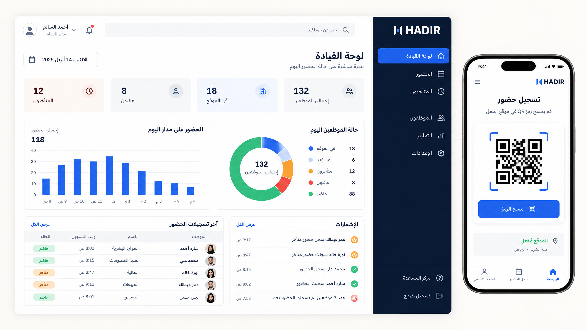
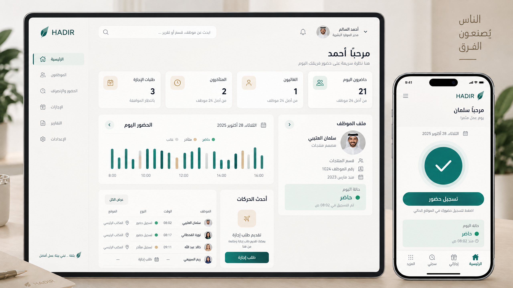
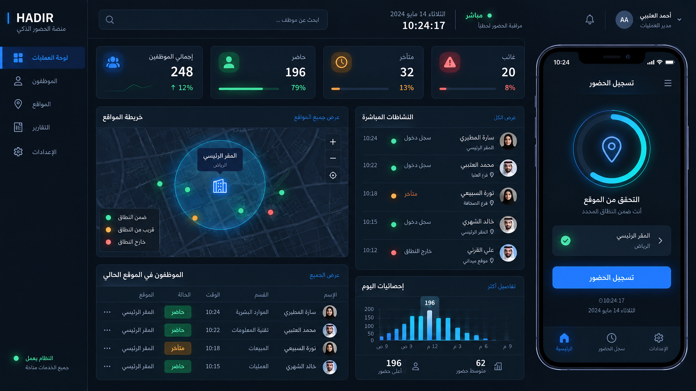
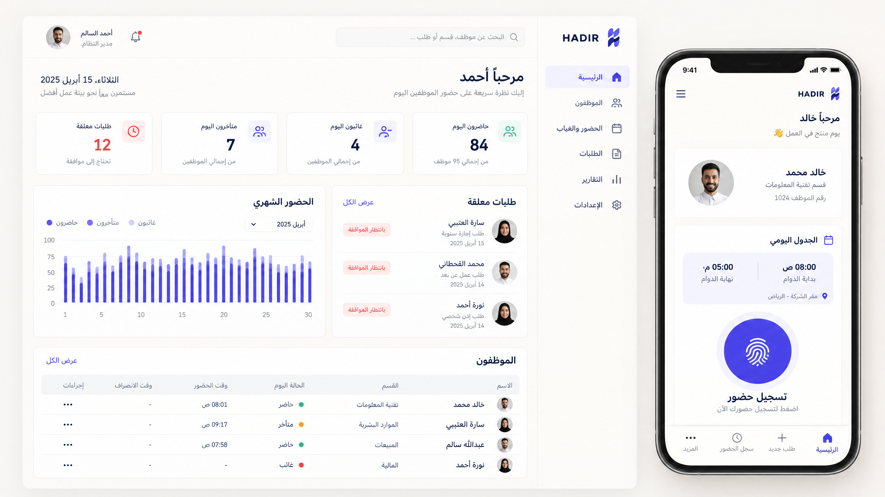

# اتجاهات إعادة تصميم واجهات «حاضر»

> **الهدف:** رفع مظهر نظام الحضور والانصراف إلى منتج احترافي حديث، مع إبقاء جميع وظائفه الحالية كما هي: الحضور بالـQR والموقع، طلبات الإجازات والاستئذان، الموظفون، التقارير، الإشعارات، التدقيق، والصلاحيات.

## ما تمت معاينته في المشروع

- واجهة React + Vite + Tailwind تعمل بالعربية واتجاه **RTL** وتدعم الوضعين الداكن والفاتح.
- التطبيق مقسوم بين تجربة الموظف المحمولة وتجربة الإدارة التشغيلية، ويحتوي على حالة حضور لحظية، تحقق موقع/QR، جداول موظفين، طلبات، تقارير، وإشعارات.
- الهوية الحالية تميل إلى خلفية داكنة ومؤشرات HUD باللونين الأخضر والسماوي. هذا جيد لفكرة «الحالة الحية»، لكنه يحتاج إلى نظام بصري أوضح وأكثر اتساقاً وتدرجاً في المعلومات.

## قواعد مشتركة لأي اتجاه يتم اختياره

| المحور | القرار المقترح |
|---|---|
| الأولوية | توضيح **حالة اليوم والإجراء التالي** للموظف، ثم عرض **الاستثناءات التشغيلية** أولاً للمدير. |
| RTL | محاذاة، ترتيب أيقونات، جداول، قوائم جانبية، وإجراءات متوافقة مع العربية من البداية. |
| الألوان | الأخضر = حضور/نجاح، الكهرماني = تأخر/تنبيه، الأحمر = غياب أو خطأ؛ ولا يُستعمل لون الحالة كزينة فقط. |
| الشاشات الصغيرة | إجراء الحضور/الانصراف واحد كبير وواضح؛ تنقّل سفلي أو شريط مختصر عند الحاجة، بدلاً من ازدحام الأزرار في الرأس. |
| الوصولية | تباين قوي، نصوص قابلة للقراءة، حالات تركيز ظاهرة، وعدم الاعتماد على اللون وحده لتفسير الحالة. |
| ما لن يتغير | مسارات النظام، الصلاحيات، منطق الحضور، الخلفية البرمجية، وبيانات المستخدمين. |

---

## 01 — لوحة القيادة التنفيذية

**الفكرة:** منتج مؤسسي نظيف وحازم. يجعل لوحة المدير مصدر قرار سريع، ويوصل الموظف مباشرة إلى الإجراء التالي.

| عنصر | التوجيه |
|---|---|
| الشخصية | احترافي، موثوق، دقيق |
| اللون المميز | أزرق ملكي `#2563EB` مع أخضر موثق للحضور فقط |
| الخلفية | عاجي/رمادي دافئ، مع شريط جانبي كحلي داكن للإدارة |
| الواجهة | بطاقات مؤشرات مختصرة، جداول واضحة، حدود رفيعة، مساحات بيضاء واسعة |
| الخط المقترح | IBM Plex Sans Arabic أو ما يكافئه مع أرقام tabular للوقت والإحصاءات |
| الموظف | بطاقة «حالة اليوم» ثم زران أساسيان للحضور والانصراف ثم الملخص |
| المدير | شريط جانبي ثابت على سطح المكتب، بطاقات حالات قابلة للنقر، وجدول استثناءات واضح |
| الحركة | انتقالات 160–220ms هادئة؛ تحديث حي للأرقام دون مؤثرات مشتتة |

**الأفضل له:** شركة تريد حضوراً مؤسسياً قابلاً للتوسع، ولوحات إدارة واضحة لفرق متعددة.

---

## 02 — الثقة الهادئة

**الفكرة:** واجهة إنسانية مريحة تقلل توتر الموظف وتبقي الإدارة واضحة. مناسبة عندما تكون تجربة الموظف والوضوح اليومي أهم من الإحساس التشغيلي الصارم.

| عنصر | التوجيه |
|---|---|
| الشخصية | هادئ، ودود، موثوق |
| اللون المميز | تركواز غابي `#0F766E` مع رمل خفيف `#EAD8B7` للتأكيد غير التحذيري |
| الخلفية | رمادي دافئ شديد الفتوح، طبقات سطحية لطيفة وظلال دقيقة |
| الواجهة | بطاقات مستديرة باعتدال، تسلسل بصري متنفّس، ومعلومات يومية مبسّطة |
| الخط المقترح | Cairo أو خط عربي إنساني واضح بأوزان متدرجة |
| الموظف | تحية شخصية، خط زمني للدوام، إجراء حضور بارز، وطلبات بسيطة مفهومة |
| المدير | ملخص يومي لطيف، قائمة طلبات مرتبة، ومؤشرات تركز على من يحتاج متابعة |
| الحركة | حركات دخول ناعمة جداً وتغذية راجعة لطيفة بعد نجاح التسجيل |

**الأفضل له:** مؤسسة تريد تعزيز ثقة الموظفين وجعل الاستخدام اليومي أخف وأكثر وداً.

---

## 03 — العمليات الحية

**الفكرة:** تطوير اتجاه الواجهة الحالية إلى مركز عمليات حقيقي؛ داكن، عالي التباين، وموجه للحالات اللحظية والموقع والتحقق.

| عنصر | التوجيه |
|---|---|
| الشخصية | تشغيلي، تقني، سريع |
| اللون المميز | أزرق حي `#3B82F6` وسماوي `#22D3EE`، مع توهج محصور في إشارات الحالة الحية |
| الخلفية | فحمي/كحلي قريب من الأسود، مع طبقات ألواح داكنة واضحة |
| الواجهة | كثافة معلومات مدروسة، ساعة حية، مؤشرات موقع، وسجل نشاط فوري |
| الخط المقترح | خط عربي واضح مع خط أحادي المسافة للأرقام والأوقات |
| الموظف | عدّاد دوام وحلقة تحقق من الموقع وزر إجراء مركزي، من دون ازدحام |
| المدير | لوحة متابعة مباشرة، فلاتر للحالات، تدفق أحداث ومؤشر جغرافي مبسّط |
| الحركة | نبض خفيف للحالة الحية فقط، ومؤشرات ظهور عند تحديث البيانات؛ احترام `prefers-reduced-motion` |

**الأفضل له:** المواقع الميدانية، فرق التشغيل، أو الجهات التي تريد إبراز طبقات الأمان والمراقبة المباشرة.

---

## 04 — المنظّم العصري

**الفكرة:** واجهة عربية حديثة بطابع تحريري راقٍ؛ تجمع الجدّية مع وضوح بصري مميز، من دون مظهر تقني زائد.

| عنصر | التوجيه |
|---|---|
| الشخصية | عصري، مرتب، واثق |
| اللون المميز | نيلي `#4F46E5` مع كورال `#F97360` للتنبيه المحدود |
| الخلفية | عاجي `#FCFAF6` ونص فحمي `#1F2937` |
| الواجهة | أقسام ذات إيقاع بصري، أرقام كبيرة، بطاقات مستطيلة ناعمة، ورسوم موجزة |
| الخط المقترح | IBM Plex Sans Arabic أو Tajawal للأرقام والعناوين الواضحة |
| الموظف | بطاقة هوية صغيرة، جدول اليوم، وزر حضور واضح ضمن تسلسل واحد |
| المدير | شريط ملخص يومي، موافقات معلقة، قائمة موظفين، ولمحة شهرية منتقاة |
| الحركة | انتقالات بنيوية بسيطة بين الأقسام، من دون خلفيات متحركة أو لمعان زائد |

**الأفضل له:** علامة تريد مظهراً مميزاً وحديثاً يصلح للعرض على العملاء والإدارة، مع بقاء النظام عملياً.

---

## توصية مبدئية

**الخيار 01 — لوحة القيادة التنفيذية** هو الترشيح الأول لهذا المشروع، لأنه ينسجم مع طبيعة «حاضر» الأمنية والإدارية ويُحسن قابلية التوسع في صفحات الموظفين والتقارير والإعدادات.  
وإذا كان الاستخدام في مواقع ميدانية والرقابة اللحظية هي محور القيمة، فاختر **03 — العمليات الحية**.

## ما سيُطبّق بعد الاختيار

1. **نظام تصميم موحّد:** ألوان، خطوط، مسافات، حدود، ظلال، شارات حالات، أزرار، حقول، وجداول.
2. **إطار تنقل جديد:** تجربة هاتف أوضح للموظف وتجربة سطح مكتب أفضل للمدير، مع الحفاظ على RTL والوضعين الداكن والفاتح عندما يناسب الاتجاه المختار.
3. **تحديث الشاشات الأساسية أولاً:** تسجيل الدخول، الرئيسية للموظف، مسار الحضور/الانصراف، لوحة المدير، الموظفون، والطلبات.
4. **تعميم متسق لاحقاً:** التقارير، التدقيق، الإعدادات، الإشعارات، والصفحات المساندة.
5. **ضبط التفاصيل التقنية:** حالات التحميل والخطأ والفراغ، التباين، التركيز بلوحة المفاتيح، والحركة المخفّضة.

## الاختيار المطلوب

أرسل أحد الخيارات التالية:

- **1** — لوحة القيادة التنفيذية
- **2** — الثقة الهادئة
- **3** — العمليات الحية
- **4** — المنظّم العصري
- أو تركيبة، مثل: **«1 مع هدوء ألوان 2»** أو **«3 لكن أقل قتامة»**.

بعد اختيارك أطبّق الاتجاه على المشروع مع الحفاظ على كل الوظائف الحالية.
